# Лабораторная 1. Linux Архитектура и файловые системы
---

## Задание 1. Kernel and Module Inspection

1. Продемонстрировать версию ядра вашей ОС.
   ```shell
   uname -a
   ```
   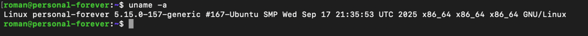

2. Показать все загруженные модули ядра.

   ```shell
   lsmod
   ```
   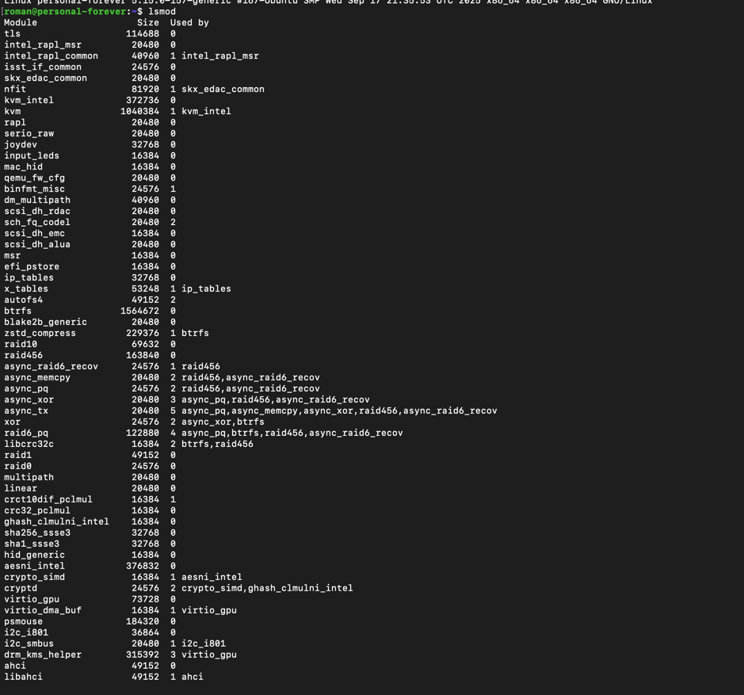

3. Отключить автозагрузку модуля cdrom.

   ```shell
   echo "blacklist cdrom" | sudo tee /etc/modprobe.d/blacklist-cdrom.conf
   ```
   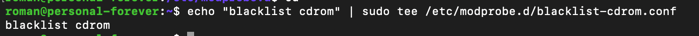

4. Найти и описать конфигурацию ядра (файл конфигурации, параметр CONFIG_XFS_FS).

   ```shell
   grep CONFIG_XFS_FS /boot/config-5.15.0-157-generic
   ```
   

   В моей конфигурации ядра файловая система XFS подключена как модуль ядра.

## Задание 2. Наблюдение за VFS

1. Используйте strace для анализа команды cat /etc/os-release > /dev/null.
   ```shell
   strace -e trace=openat,read,write,close cat/etc/os-release > /dev/null
   ```
   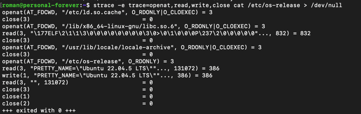
2. 
   `strace` - утилита для диагностики, запускается для анализа вызова `cat /etc/os-release`, вывод которого
   перенаправляется в `null`, чтобы не засорять консоль.

   | Операция                                                                                   | Описание                                               | Для чего                                           |
   |--------------------------------------------------------------------------------------------|--------------------------------------------------------|----------------------------------------------------|
   | `openat(AT_FDCWD, "/etc/ld.so.cache", O_RDONLY\| O_CLOEXEC) = 3`                           | Открытие кэша .so                                      | Для получения cat                                  |
   | `openat(AT_FDCWD, "/lib/x86_64-linux-gnu/libc.so.6", O_RDONLY\|O_CLOEXEC) = 3`             | Открытие библиотеки C                                  | для работы системных вызовов read, write open и тд |
   | `read(3, "\177ELF\2\1\1\3\0\0\0\0\0\0\0\0\3\0>\0\1\0\0\0P\237\2\0\0\0\0\0"..., 832) = 832` | Чтение байт библиотеки                                 | для работы системных вызовов read, write open и тд |
   | `openat(AT_FDCWD, "/usr/lib/locale/locale-archive", O_RDONLY\|O_CLOEXEC) = 3`              | Открытие библиотеки локалей                            | Для корректного отображения локалей                |
   | `openat(AT_FDCWD, "/etc/os-release", O_RDONLY) = 3`                                        | Открытие файла /etc/os-release с информацией о системе | Для отображение командой cat                       |
   | `read(3, "PRETTY_NAME=\"Ubuntu 22.04.5 LTS\""..., 131072) = 386`                           | Чтение байт из файла                                   | Для отображение командой cat                       |
   | `write(1, "PRETTY_NAME=\"Ubuntu 22.04.5 LTS\""..., 386) = 386`                             | Запись байт в поток вывода                             | Для отображение командой cat                       |
   | `read(3, "", 131072) = 0`                                                                  | Конец файла                                            | Для отображение командой cat                       |
   | `close(n)`                                                                                 | Закрытия ресурса и освобождения дескриптора            | Для освобождения и переиспользования дескриптора   |
   Записывающий вызов есть только для записи в поток вывода. Других вызовов нет, так как вызов только отображает информацию в поток вывода.
   Содержимое: 
   ```
   PRETTY_NAME="Ubuntu 22.04.5 LTS"
   NAME="Ubuntu"
   VERSION_ID="22.04"
   VERSION="22.04.5 LTS (Jammy Jellyfish)"
   VERSION_CODENAME=jammy
   ID=ubuntu
   ID_LIKE=debian
   HOME_URL="https://www.ubuntu.com/"
   SUPPORT_URL="https://help.ubuntu.com/"
   BUG_REPORT_URL="https://bugs.launchpad.net/ubuntu/"
   PRIVACY_POLICY_URL="https://www.ubuntu.com/legal/terms-and-policies/privacy-policy"
   UBUNTU_CODENAME=jammy
   ```

## Задание 3. LVM Management (40 баллов)
1. Добавил новый диск к ВМ в интерфейсе облака
2. Выделил раздел на диске `sudo fdisk /dev/vdb`
3. Создал **Persistent Volume** `sudo pvcreate /dev/vdb1 `
4. Создал **Volume Group** `sudo vgcreate vg_highload /dev/vdb1`
5. Создал 2 **Logical Volume** по 1.2Gb и 0.8Gb 
   `sudo lvcreate -L 1200M -n data_lv vg_highload`
   `sudo lvcreate -l 100%FREE -n logs_lv vg_highload`
6. Отформатировал и примонтировал
   ```shell
   sudo mkfs.ext4 /dev/vg_highload/data_lv
   sudo mkdir -p /mnt/app_data
   sudo mount /dev/vg_highload/data_lv /mnt/app_data
   ```
   ```shell
   sudo mkfs.xfs /dev/vg_highload/logs_lv
   sudo mkdir -p /mnt/app_logs
   sudo mount /dev/vg_highload/logs_lv /mnt/app_logs
   ```

   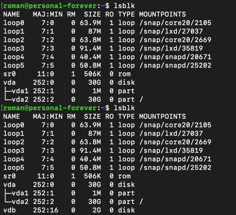
   
   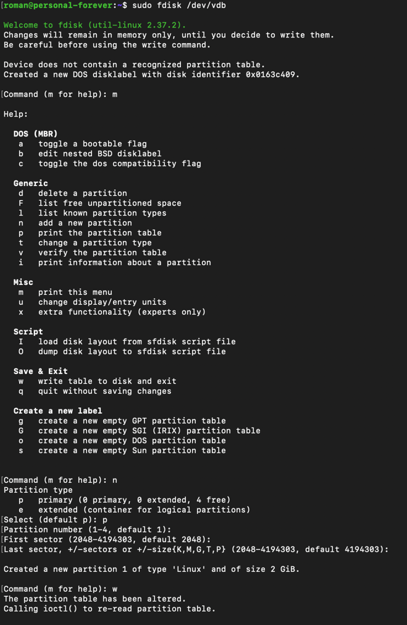
   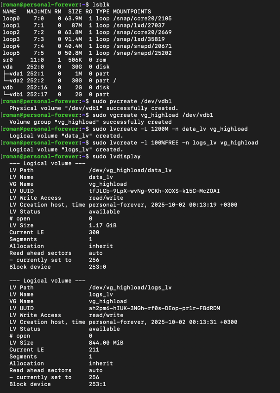
   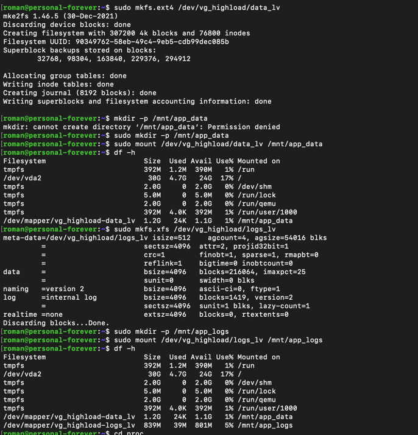

## Задание 4
1. Извлечь из `/proc` модель CPU и объём памяти (KiB).
   ```shell
   grep "MemTotal" /proc/meminfo
   ```
   
   

   ```shell
   grep "model name" /proc/cpuinfo
   ```
   
   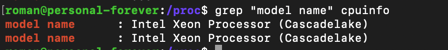

   - Модель CPU - `Intel Xeon Processor (Cascadelake)`
   - Объем памяти -  4005712 Kib ~= 4 Gb

2. Используя /proc/\$$/status, найдите Parent Process ID (PPid) вашего текущего shell. что означает $$ ?
   
   - `Ppid` = 1310 - идентификатор родительского процесса.
   - `$$` - содержит значение - идентификатор текущего процесса. 
   - В директории /proc/\<`id`> содержатся данные, относящиеся к процессу с этим `id`
   
   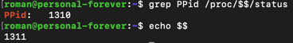
3. Определить настройки I/O scheduler для основного диска /dev/sda.
   ```shell
   cat /sys/block/vda/queue/scheduler
   ```
   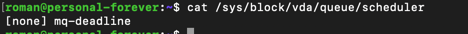
   - Используется планировщик `none` - простой, не делает приоритетов.
   - Установлены, но не используются `md-dedline` - многопоточный вариант deadline, обеспечивает справедливое обслуживание, 
   `bfq` - распределяет диск между процессами используя бюджеты

4. Определить размер MTU для основного сетевого интерфейса (например, eth0 или ens33).
   ```shell
   ip link show
   ```

   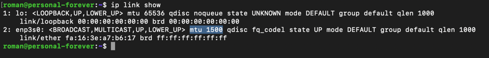

   `mtu = 1500` - максимальный размер пакета в байтах
