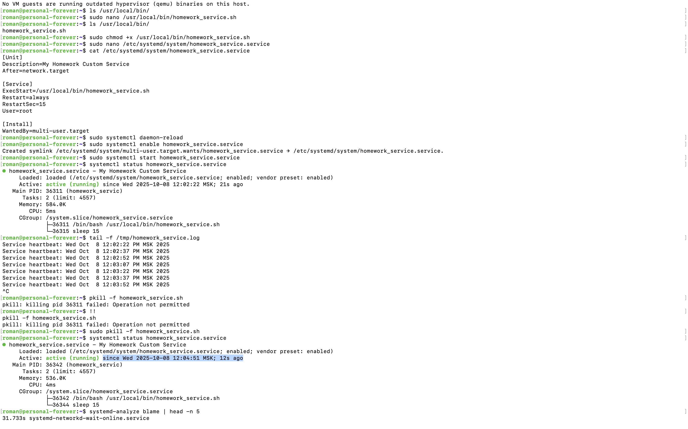
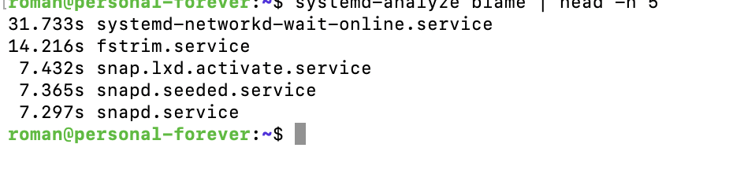
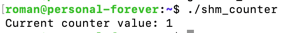
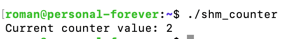
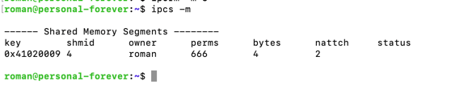
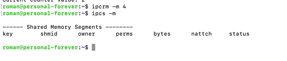
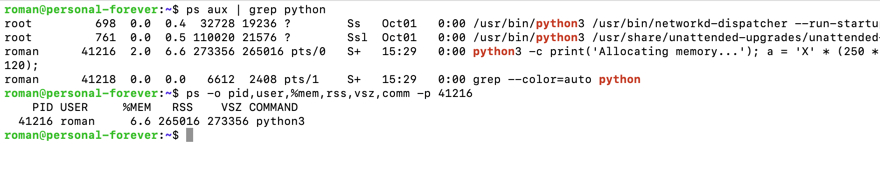
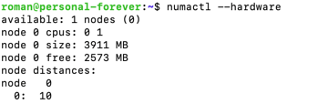
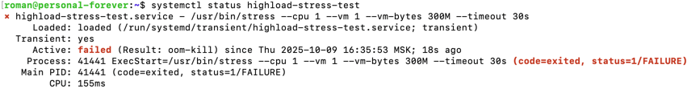
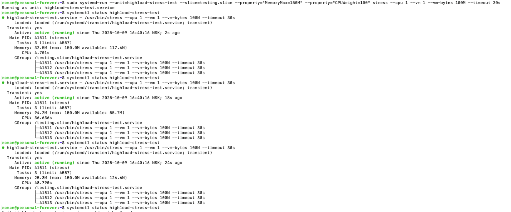

# Linux работа с памятью и процессами

## Задание 1. Systemd
1. Создайте systemd unit файл для скрипта, который бы переживал любые обновления системы. Убедитесь, что сервис сам перезапускается в случае падения через 15 секунд.
    ```shell
    [Unit]
    Description=My Homework Custom Service        # описание
    After=network.target                          # запуск после сетевых служб
    
    [Service]
    ExecStart=/usr/local/bin/homework_service.sh  # путь к скрипту
    Restart=always                                # перезапуск всегда
    RestartSec=15                                 # рестарт через 15 секунд
    User=root                                     # запуск от root
    
    [Install]
    WantedBy=multi-user.target                    # запуск в обычном многопользовательском режиме
    ```
2. Запустите сервис и убедитесь, что он работает.
    ```shell
    sudo systemctl daemon-reload                    # обновление конфигурации после добавления юнита
    sudo systemctl enable homework_service.service  # включение автозапуска при старте системы
    sudo systemctl start homework_service.service   # запуск сейчас
    systemctl status homework_service.service       # просмотреть статус
    ```

    Проверка перезапуска после падения.

    ```shell
    sudo pkill -f homework_service.sh # убьем процесс
    ```

    Через 15 секунд он снова в состоянии active (running)

    

3. Используя systemd-analyze, покажите топ-5 systemd unit`ов стартующих дольше всего.
    ```shell
    systemd-analyze blame | head -n 5  # показать список юнитов и оставить топ 5
    ```

    

## Задание 2. Межпроцессное взаимодействие (IPC) с разделяемой памятью

1. Создайте шареную память:
На любом языке программирования создайте программу использующую шареную память.

    Код - `shm_counter.c`. Счетчик с шареной памятью

2. Скомпилируйте и запустите
    ```shell
    nano shm_counter.c 
    touch homework_key
    gcc shm_counter.c -o shm_counter
    ./shm_counter 
    ```
3. Пока программа запущена (60 секунд), проанализируйте вывод:
   в соседнем терминале.
    
   ```shell
    ipcs -m
    ```
   
   Запустил программу с двух терминалов, в третьем выполнил `ipcs -m`.
   - `nattch` = 2 указывает на то, что в момент анализа шареную память использует 2 процесса.
   - `key` = 0x41020009 сгенерированный ключ
   - `shmid` = 4 id сегмента шареной памяти
   - `owner` = roman - владелец
   - `perms` = 666 права на чтение/запись всем
   - `bytes` = 4 размер сегмента в байтах

   
   
   

4. После завершения удалим сегмент памяти
   ```shell
   ipcrm -m 4
   ipcs -m
   ```

   

## Задание 3. Анализ памяти процессов (VSZ vs RSS) (20 баллов)
1. Откройте 1 окно терминала и запустите питон скрипт, который запрашивает 250 MiB памяти и держит ее 2 минуты
   ```shell
   python3 -c "print('Allocating memory...'); a = 'X' * (250 * 1024 * 1024); import time; print('Memory allocated. Sleeping...'); time.sleep(120);"
   ```
   
2. Пока скрипт запущен, откройте вторую вкладку, найдите там PID запущенного скрипта и проанализируйте использование RSS и VSZ:
   ```shell
   ps aux | grep python
   ps -o pid,user,%mem,rss,vsz,comm -p 41216
   ```

   

3. Объясните почему vsz больше rss, и почему rss далеко не 0
   
   `VSZ` - все виртуальное адресное пространство, включающее и не используемые области.

   `RSS` - реально используемая физическая память. Он != 0, т.к. программа реально использует память для хранения полученной строки

   `VSZ > RSS` потому что процессу выделено больше памяти, чем он реально использует.

## Задание 4. NUMA и cgroups (35 баллов)

1. Продемонстрируйте количество NUMA нод на вашем сервере и количество памяти для каждой NUMA ноды
   ```shell
   numactl --hardware
   ```

   Присутствует 1 NUMA нода.   

   

2. Будет ли работать тест если мы запрашиваем 300М оперативной памяти, а ограничивыаем 150М?
   
   Нет, процесс попытается выделить себе больше памяти, чем ему доступно из-за чего упадет с OOM.
   
   

4. В соседней вкладке проследите за testing.slice при помощи systemd-cgls. Привысило ли использование памяти 150М ? Что происходит с процессом при превышении? Попробуйте использовать разные значения
   
   Запустил изменив значение параметра `--vm-bytes=100М`. Использование памяти не превысило доступных 150М.
   
   
6. Опишите что делает и для чего можно использовать MemoryMax and CPUWeight.

   `MemotyMax` - максимальный размер памяти доступный cgroups. Используется для ограничения используемой памяти.
   `CPUWeight` - относительный вес или приоритет процесса на использование процессорного времени. Используется для управления приоритетами. Чем больше значение, тем больше, относительно остальных, процесс получит процессорного времени.