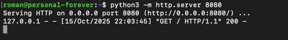
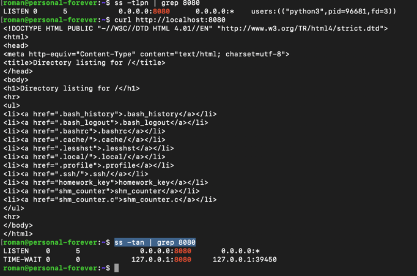
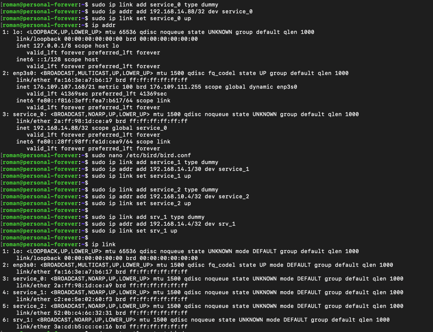
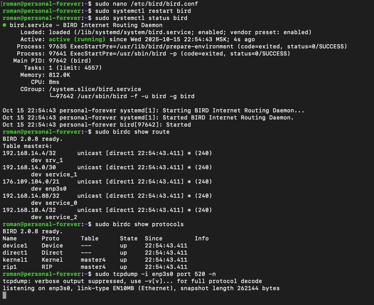
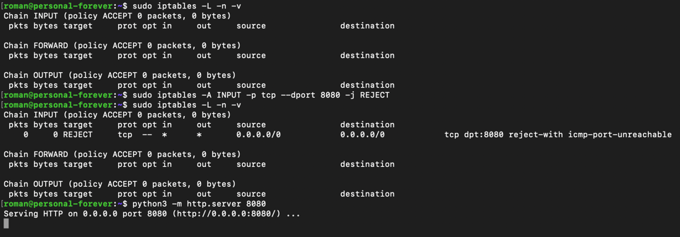
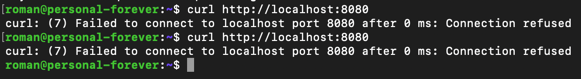
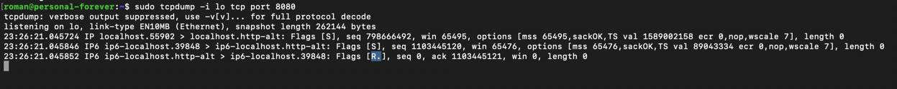
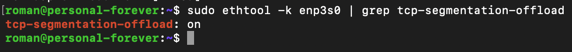

# lab3 Сетевой стек

## Задание 1. Анализ состояний TCP-соединений (25 баллов)
1. Запустите Python HTTP сервер на порту 8080:
2. python3 -m http.server 8080
3. Проверяйте слушающие TCP-сокеты с помощью утилиты ss. найдите сокет с вашим http сервером.
    ```shell
    ss -tlpn | grep 8080
    ```
   - `-t` - tcp
   - `-l` - только слушающие сокеты
   - `-p` - показать процесс
   - `-n` - не резолвить имена
4. Подключитесь к серверу через curl.
   ```shell
   curl http://localhost:8080
    ```
5. Проанализируйте состояние TCP-сокетов для порта 8080, объясните, почему есть сокет в состоянии TIME-WAIT, его роль и почему его нельзя удалить.
    ```shell
   ss -tan | grep 8080
    ```
   - `-a` - все сокеты
   
    Состояние TIME-WAIT - это соединение, которое было закрыто. Такое состояние необходимо для возможности получения задержавшихся пакетов, корректного закрытия соединения, а так же, чтобы пакеты от новых соединений не перепутались с пакетами старого.
6. Опишите, к каким проблемам может привести большое количество TIME-WAIT сокетов.
    Соединения могут находится в этом состояние довольно долго, и в какой-то момент могут закончиться свободные сокеты.
   

   

## Задание 2. Динамическая маршрутизация с BIRD (35 баллов)
1. Создайте dummy-интерфейс с адресом 192.168.14.88/32, назовите его service_0.
   Создал при помощи `ip link add` и `ip addr add`
2. При помощи BIRD проаннонсируйте этот адрес при помощи протокола RIP v2 включенного на вашем интерфейсе (eth0/ens33), а так же любой другой будущий адрес из подсети 192.168.14.0/24 но только если у него будет маска подсети /32 и имя будет начинаться на service_
   Описал конфиг в /etc/bird/bird.conf (файл приложил).

   `sudo birdc show route` - проверим, что маршруты появились.
3. Создайте ещё три интерфейса:
    ```
   service_1 192.168.14.1/30
   service_2 192.168.10.4/32
   srv_1 192.168.14.4/32
   ```
   
   

   
4. С помощью tcpdump докажите, что анонсируются только нужные адреса, без лишних.

   С помощью `tcpdump` не удалось увидеть пакетов. Я предполагаю, потому что нет соседей и пакеты не передаются.

   То что анонсируются только нужные адреса получилось удостовериться при помощи `sudo birdc show route` фильтром RIP,


## Задание 3. Настройка фаервола/ Host Firewalling (25 баллов)
1. С помощью iptables или nftables создайте правило, запрещающее подключения к порту 8080.
   ```shell
   sudo iptables -A INPUT -p tcp --dport 8080 -j REJECT
   ```
2. Запустите веб сервер на питоне и продемонстрируйте работу вашего firewall при помощи tcpdump.
   ```shell
   python3 -m http.server 8080
   curl http://localhost:8080
   ```

   В ответ на запросы приходит `Connection refused`.

   В `tcpdump` видно, что на запрос ответ с флагом R - reject
   
   
   

## Задание 4. Аппаратное ускорение сетевого трафика (offloading) (15 баллов)
1. С помощью ethtool исследуйте offload возможности вашего сетевого адаптера.
2. Покажите включён ли TCP segmentation offload.
   ```shell
   sudo ethtool -k enp3s0 | grep tcp-segmentation-offload
   ```
   
3. Объясните, какую задачу решает TCP segmentation offload.
   
   Когда включено, позволяет снизить нагрузку с CPU по разделению данных на MTU пакеты, перекладыванием этой обязанности на сетевую карту (NIC).
