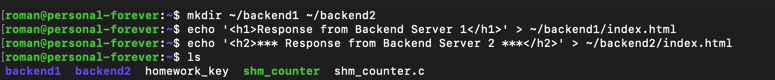
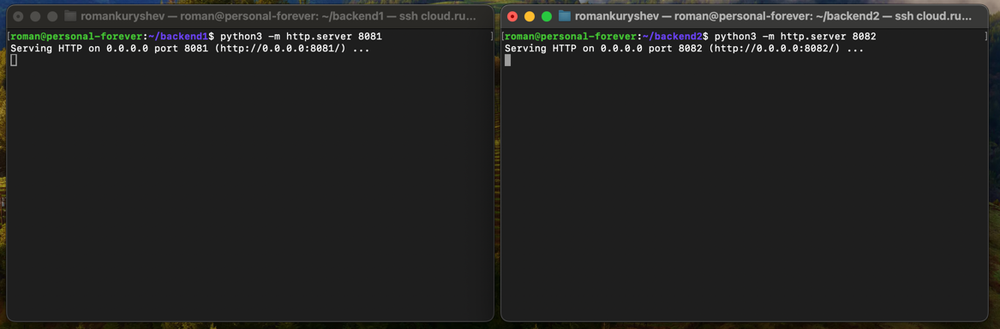
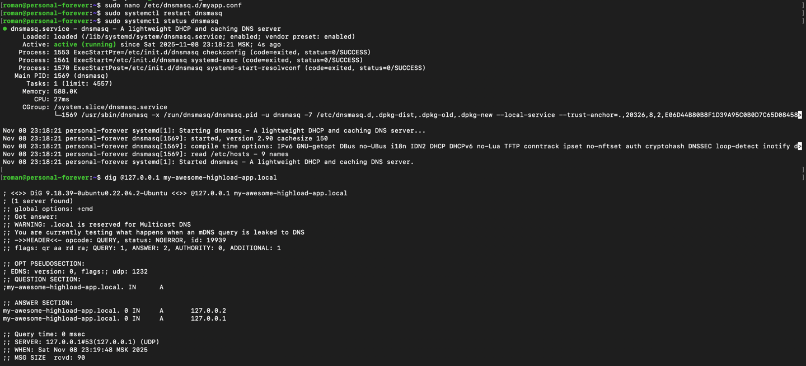
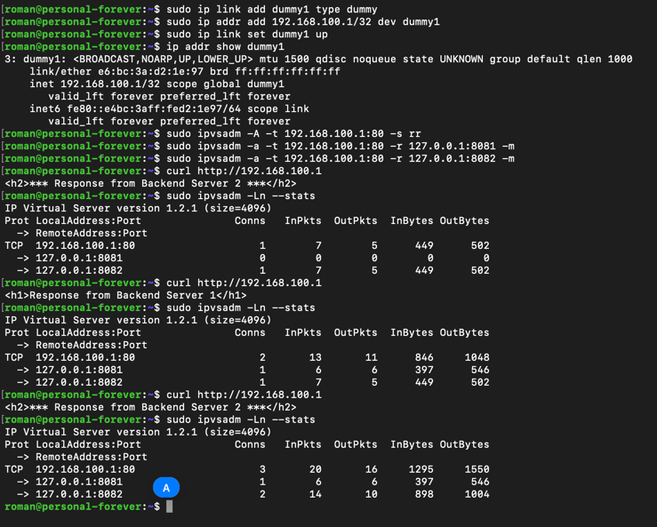
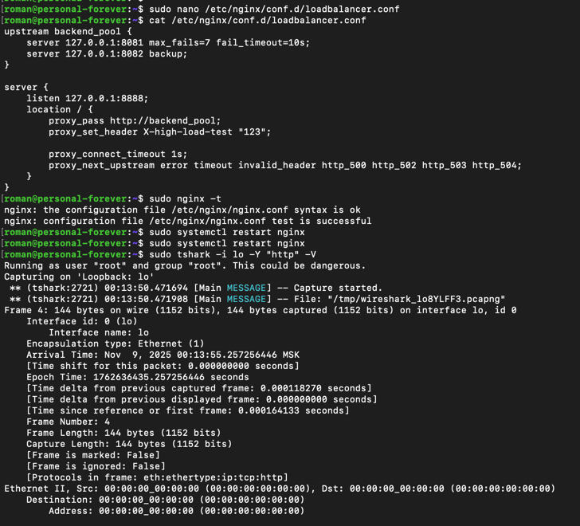
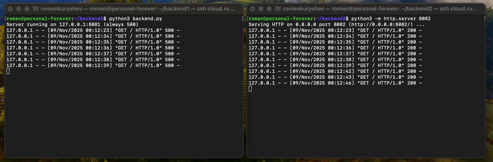
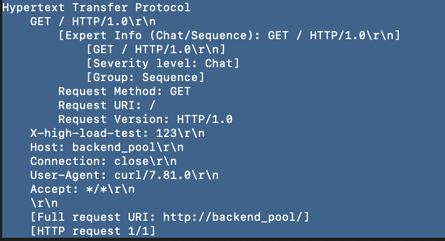
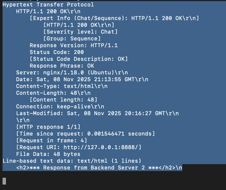

# Лабораторная 4

## Задание 1. Создание Server Pool для backend (10 баллов)
- Создайте у себя в home dir 2 папки ~/backend1 и ~/backend2, в каждой из которых должен лежать 1 index.html
- внутри этих папок запустите питоновый http сервер на портах 8081 и 8082 соответсвенно.

    

    

    Создал директории и файлы, запустил python серверы. 

## Задание 2. DNS Load Balancing с помощью dnsmasq (20 баллов)
- При помощи dnsmasq создайте 2 A записи
  - my-awesome-highload-app.local,127.0.0.1 
  - my-awesome-highload-app.local,127.0.0.2
- Запустите dnsmasq и при помощи dig обратитесь к 127.0.0.1 для резолва my-awesome-highload-app.local
- Проанализируйте вывод, что произойдет с DNS записями если backend2 сервер сломается?

  

  Конфигурация `dnsmasq`:

  ```shell
  address=/my-awesome-highload-app.local/127.0.0.1
  address=/my-awesome-highload-app.local/127.0.0.2
  listen-address=127.0.0.1
  ```

  Если backend2 сломается, то DNS все равно ничего не узнает об этом — он продолжит возвращать обе записи.  Это происходит потому, что проверять работоспособность IP адресов не является обязанностью DNS.
  Отказоустойчивость обеспечивается на уровне балансировщика (L4/L7), а не DNS.

## Задание 3. Балансировка Layer 4 с помощью IPVS (35 баллов)
- Создайте dummy1 интерфейс с адресом 192.168.100.1/32
- Используя ipvsadm создайте VS для TCP порта 80 ведущего в 127.0.0.1:8081 и 127.0.0.1:8082 использующего round-robin тип балансировки.
- Используя curl сходите в http://192.168.100.1 продемонстрируйте счетчики на ipvs, убедитесь, что балансировка происходит.

  
  
  Создал dummy интерфейс.

  При помощи `ipvsadm` настроил round-robin балансировщик:

  - `-t` - tcp балансировщик
  - `-s rr` - round-robin
  - `-a` - добавить реальный сервер

  Выполнил несколько запросов. Видно, что каждый по очереди увеличивает счетчик одного из серверов.

## Задание 4. Балансировка L7 с помощью NGINX (35 баллов)
- Создайте пул из  127.0.0.1:8081 и 127.0.0.1:8082 в nginx с active-backup балансировкой.
- Убедитесь, что переключение на backup сервер происходит после 7 неудачных попыток сходить в активный сервер.
- Nginx должен слушать только 127.0.0.1 tcp порт 8888 и проставлять заголовок X-high-load-test 123 проксируя в аптсрим. Покажите при помощи tshark http запрос и ответ

1. Создал конфиг для `nginx`.
2. Вместо первого backend сервера поднял сервер на питоне, который на все запросы отдает `500`.
3. Вызвал при помощи `curl` большое `7` раз запрос на сервер. На скриншоте видно, что после 7 запросов nginx переключил на бэкап и перестал слать запросы в основной сервер.
4. В запросах прокидывается заголовок X-high-load-test
  

  

  

  
